python3 -m http.server
# Ireland's 2022 Rugby Tour of New Zealand

This website aims to provide a convenient place to find all the relevant info about Irelands's 2022 rugby tour of New Zealand. I found that I was searching for a few different wesbites to find information about the tour, so this website aims to bring all the sites I wanted into one place. Hopefully, others will also find the sites I looked for of interest to them. View the live site [here.](https://adammkeane.github.io/nz-ire-2022/)

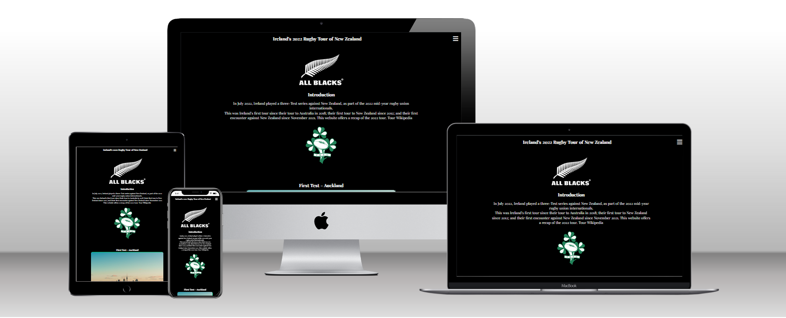

## Features

### Site wide
* Navigation Menu
    * Contains links to the Home, the three Test Match and Sign Up pages, and will be responsive on all devices.
    * This will allow users to easily navigate between the pages within the site on any size device. 
    * Uses an expandable and contractable hamburger menu design to allow it to be hidden when not needed.

Nav Menu Open
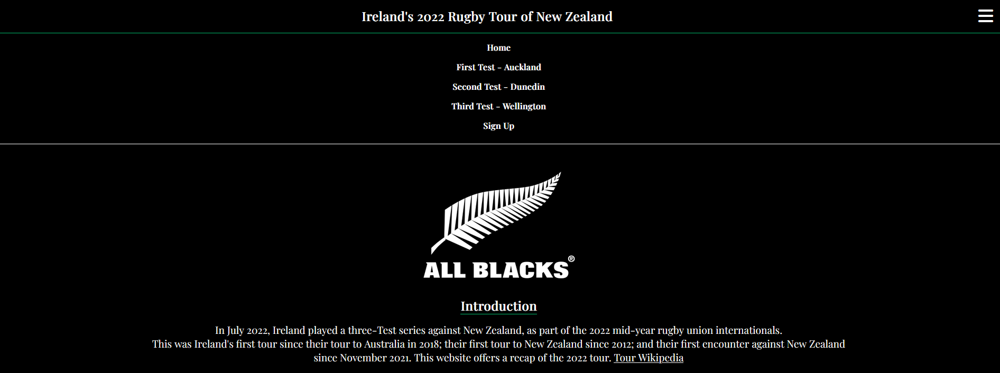

Nav Menu Closed
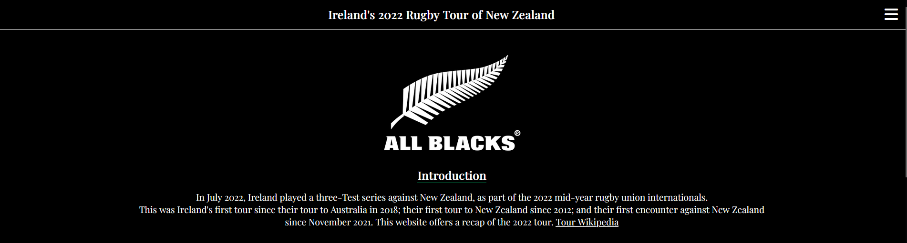

* Footer
    * This will contain icons as links to social media websites that will open in new tabs. 
    * Icons will be accessible to the visually impaired who may be using a screen reader, by the use of aria labels.
    * This will allow users to a way follow our social media content and stay up to date with our porjects.


* Favicon
    * A site wide favicon has been implemented with a custom emblem.
    * This will provide an image in the the tabs header to allow the user to easily identify the website if they have multiple tabs open.

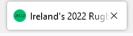

* Custom 404 Page
    * A custom 404 page was implemented and will display if a user navigates to a broken link.
    * A link is also provided back to the website's home page. This allows users to understand what went wrong and get them back to where they want to be.

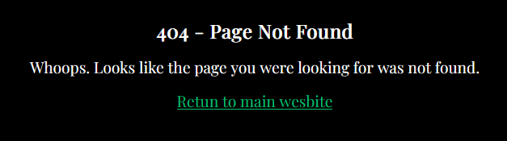

### Home Page
* Introductory text and images
    * Provides users an overview of what the site aims to provide.
    * Uses the logos of the two teams in question to quickly show viewers the two teams involved.
    * Provides users a link to wikipedia for more information about the tour, if they want further details.

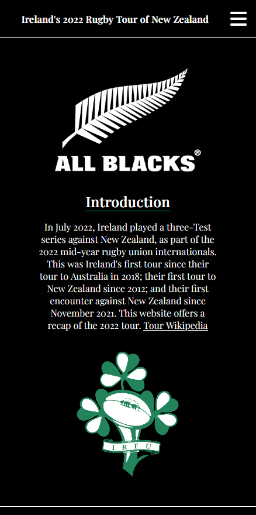

* The three test images/links
    * Provides hopefully eye catching images to direct the user to the three main pages of the site (information about each of the test matches).
    * These image/text links will allow the user to access these main site pages.

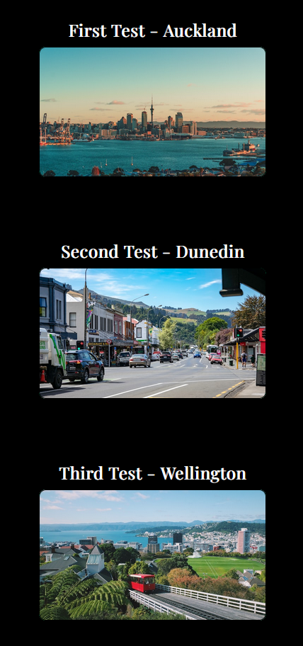

* Sign up explainer
    * Provides reasons why a user may want to sign up and provides them with links to do so.
    * Signing up will allow users to stay up to date with future projects of the website creators.

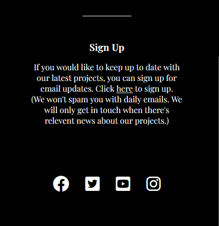

### The Three Test Match Pages
* Introductory info and embdeded Youtube video.
    * Provides the basic game informations, such as date and location.
    * Provides embeded Youtube video that won't autoplay when the page opens. The user can choose when and if they want to watch.
    * This allows users to see the most important moments of the match, and get a good sense of the key info about the match.

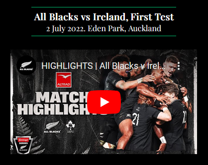

* City information
    * Provides some hopefully interesting nuggets about the city the match was played in.
    * Provides a link to the city's wikipedia page for further information.
    * This allows users to get more deeply involved in the tour. They can learn some historical background about the city and country the tour is taking place in.

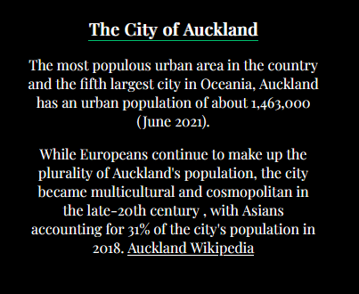

* Embedded Google map
    * Provides a map view of the stadium where the match was played.
    * User may explore the surrounding area on the map if they like.
    * This, again, allows users to get more deeply involved in the tour.

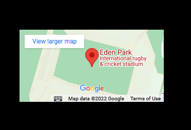    

### Sign Up Page
* Sign up form
    * Provides a hopefully simple form which user can fill out if they would like to kept up to date with our other projects.
    * The form will require a name and an email address before submitting. 
    * User can optionally select to specific if they are interested in any particular sports that will likely create projects for in the future.
    * Signing up will allow users to stay up to date with future projects of the website creators.

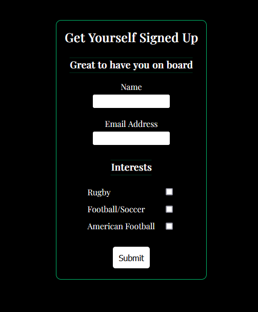

### Features Left to Implement

* A page where users can play an interactive rugby game on the site.

## Technologies

* HTML
    * The structure of the Website was developed using HTML as the main language.
* CSS
    * The Website was styled using custom CSS in an external file.
* Javascript
    * The hamburger navigation bar was built with the help of Javascript code found online.
* GitHub
    * Source code is hosted on GitHub and delpoyed using Git Pages.
* Git 
    * Used to commit and push code during the development opf the Website
* Font Awesome
    * Icons obtained from https://fontawesome.com/ were used as the Social media links in the footer section. 
* TinypNG
    * https://tinypng.com/ was used to reduce the size of the images used throughout the website
* Favicon.io
    * favicon files were created at https://favicon.io/

## Testing 

### Responsiveness

All pages were tested to ensure responsiveness on screen sizes from 320px and upwards as defined in [WCAG 2.1 Reflow criteria for responsive design](https://www.w3.org/WAI/WCAG21/Understanding/reflow.html) on Chrome, Edge, Firefox and Opera browsers.

Steps to test:

1. Open browser and navigate to [Ireland's 2022 Rugby Tour of New Zealand](https://adammkeane.github.io/nz-ire-2022/)
2. Open the developer tools (right click and inspect)
3. Set to responsive and decrease width to 320px
4. Set the zoom to 50%
5. Click and drag the responsive window to maximum width

Expected:

Website is responsive on all screen sizes and no images are pixelated or stretched.
No horizontal scroll is present.
No elements overlap.

Actual:

Website behaved as expected.

Website was also opened on the following devices and no responsive issues were seen:

- Google Pixel 3a
- Dell XPS 15
- iPhone Mini


### Accessibility

[Wave Accessibility](https://wave.webaim.org/) tool was used throughout development and for final testing of the deployed website to check for any aid accessibility testing.

Testing was focused to ensure the following criteria were met:

- All forms have associated labels or aria-labels so that this is read out on a screen reader to users who tab to form inputs
- Color contrasts meet a minimum ratio as specified in [WCAG 2.1 Contrast Guidelines](https://www.w3.org/WAI/WCAG21/Understanding/contrast-minimum.html)
- Heading levels are not missed or skipped to ensure the importance of content is relayed correctly to the end user
- All content is contained within landmarks to ensure ease of use for assistive technology, allowing the user to navigate by page regions
- All not textual content had alternative text or titles so descriptions are read out to screen readers
- HTML page lang attribute has been set
- Aria properties have been implemented correctly
- WCAG 2.1 Coding best practices being followed

### Functional Testing

**Navigation Links**
Testing was performed to ensure all navigation links on the respective pages, navigated to the correct pages as per design. This was done by clicking on the navigation links on each page.

| Navigation Link | Page to Load    |
| --------------- | --------------- |
| Home                  | index.html      |
| First Test - Auckland | test-one.html |
| Second Test - Dunedin | test-two.html    |
| Third Test - Wellington | test-thre.html    |
| Sign Up | sign-up.html    |

Links on all pages navigated to the correct pages as exptected.

**Form Testing**

The form on the signup page was tested to ensure it functioned as expected when correct data was input and when incorrect data was input.
- Tried inputting all information correctly, and was taken to the expected form summary page from Code Insitute.
- Tried inputting a non-email address into the email addess field. The submit button rejected subimssion as expected.
- Tried leaving the name field black and clicking sumbit. As expected, the submit button rejected subimssion.

**Footer Social Media Icons / Links**
Testing was performed on the Font Awesome Social Media icons in the footer to ensure that each one opened in a new tab and that each one had a hover affect of the orange branding color.

Each item opened a new tab when clicked as expected and correct hover color was present.

### Validator Testing 

- HTML
  - No errors were found when passing through the official [W3C validator](https://validator.w3.org)

- CSS
  - No errors were found when passing through the official [(Jigsaw) validator](https://jigsaw.w3.org/css-validator/)

### Unfixed Bugs
Flavicon not showing up on deployed site.

## Deployment

### Version Control

The site was created using the Visual Studio code editor and pushed to github to the remote repository ‘tacos-travels’.

The following git commands were used throughout development to push code to the remote repo:

```git add .``` - This command was used to add the file(s) to the staging area before they are committed.

```git commit -m 'commit message'``` - This command was used to commit changes to the local repository queue ready for the final step.

```git push``` - This command was used to push all committed code to the remote repository on github.

### Deployment to Github Pages

- The site was deployed to GitHub pages. The steps to deploy are as follows: 
  - In the GitHub repository, navigate to the Settings tab 
  - From the menu on left select 'Pages'
  - From the source section drop-down menu, select the Branch: main
  - Click 'Save'
  - A live link will be displayed in a green banner when published successfully. 

The live link can be found here - https://adammkeane.github.io/nz-ire-2022/ 

### Clone the Repository Code Locally

Navigate to the GitHub Repository you want to clone to use locally:

- Click on the code drop down button
- Click on HTTPS
- Copy the repository link to the clipboard
- Open your IDE of choice (git must be installed for the next steps)
- Type git clone copied-git-url into the IDE terminal

The project will now of been cloned on your local machine for use.

## Credits 

* [W3Schools' Navigation Menu](https://www.w3schools.com/howto/howto_js_mobile_navbar.asp)
    * Code was used from this site to create the hamburger navigation bar.
* [Flexbox Froggy](https://flexboxfroggy.com/)
    * This game was very helpful in teaching me how to use Flexbox.
* [Love Running Walkthrough Project](https://learn.codeinstitute.net/courses/course-v1:CodeInstitute+LR101+2021_T1/courseware/4a07c57382724cfda5834497317f24d5/f2db5fd401004fccb43b01a6066a5333/)
    * Code was used from this Code Institute project to create the footers and sign up form.
* [The Web Developer Bootcamp 2022](https://www.udemy.com/course/the-web-developer-bootcamp/)
    * This course was a helpful supplement to the Code Institute course, and was helpful in solidifying the concepts needed to create this website.

### Content 

* Introduction text on home page is from [Wikipedia article](https://en.wikipedia.org/wiki/2022_Ireland_rugby_union_tour_of_New_Zealand).
* Text on first test match page is from [Wikipedia article](https://en.wikipedia.org/wiki/Auckland).
* Text on second test match page is from [Wikipedia article](https://en.wikipedia.org/wiki/Dunedin).
* Text on third test match page is from [Wikipedia article](https://en.wikipedia.org/wiki/Wellington).

### Media

* Home team logos came from (find websites)
* Home page city images came from (find websites)
* Youtube videos on the test match pages came from
